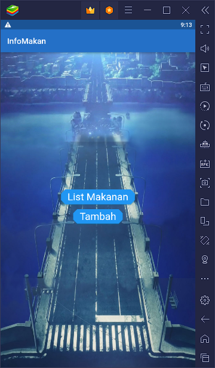
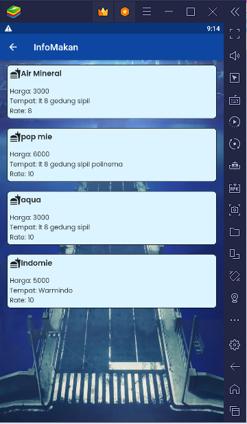
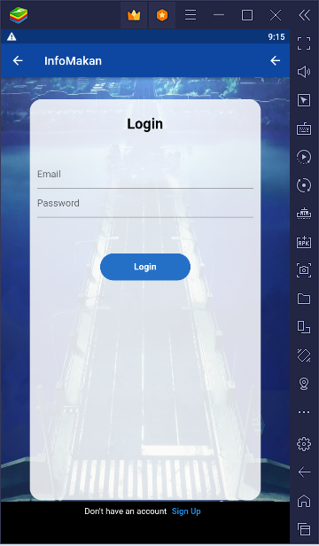
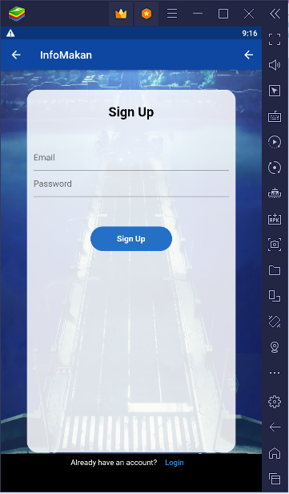
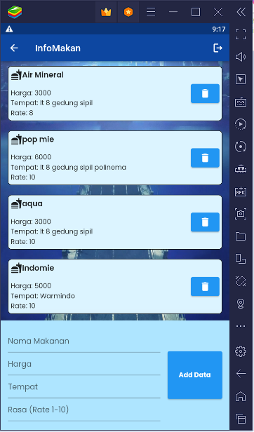

# UAS Pemrograman Mobile Flutter

UAS Pemrograman Mobil Flutter
Nama  : R.Muhammad Azmi Herdi Shofiyullah
Kelas : TI-3A
Absen : 21 

Link kode aplikasi InfoMakan : 
https://drive.google.com/file/d/1TD89WvraOVGXpiNdLSeQjNQYNToS2CYM/view?usp=sharing

## Hasil

